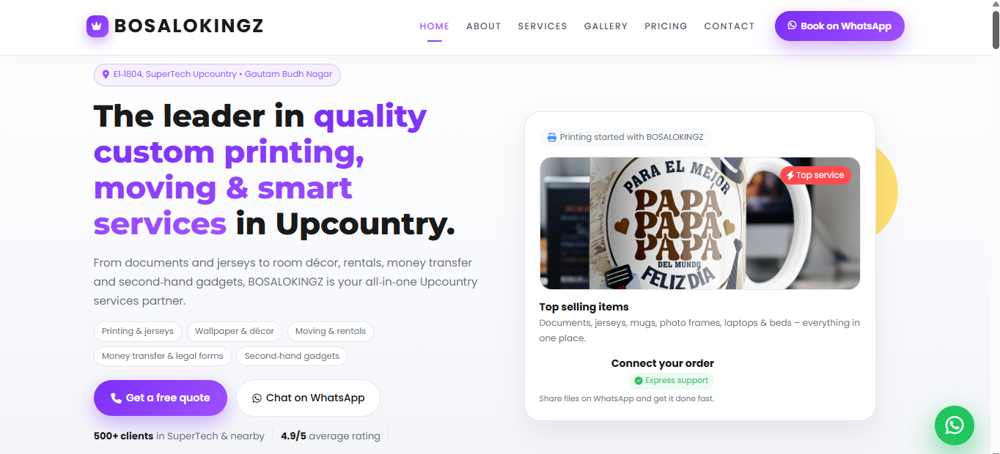

# 👑 BOSALOKINGZ Premium Business Website

Modern multi‑service business website for a real Delhi‑based brand, crafted for conversion, trust, and high‑end visual impact.  

> Printing • Branding • Rentals • Moving • Decor • Smart Solutions

---

### 🚀 Live Demo

▶ **Live Demo**  
<!-- Live link is intentionally hidden in a comment; replace with your own URL if you fork the project -->
<!-- https://bosalokingz-premium-business.vercel.app/ -->

---

## 🖼 Screenshot

A quick visual preview of the homepage:

 

---

## 📌 About The Project

This is a fully responsive, production‑ready business website built for **BOSALOKINGZ**, a real multi‑service local business offering professional services under one roof. [web:24]  
The layout is optimized for clarity, trust, and lead generation, making it ideal as both a client deliverable and a portfolio centerpiece.

The project focuses on:

- ✅ **Strong** UI/UX and visual hierarchy  
- ✅ Real client business flows and content  
- ✅ Conversion‑focused hero and call‑to‑action sections  
- ✅ Mobile‑first, responsive implementation  
- ✅ Clean, scalable frontend architecture

---

## 💼 Services Covered

All core services of BOSALOKINGZ are represented with dedicated UI elements and icons:

- ✔ Document printing and photocopy services  
- ✔ Passport photos and quick ID printing  
- ✔ Jersey printing, sales, and custom sportswear  
- ✔ T‑shirt and gift branding (mugs, frames, etc.)  
- ✔ Room wallpaper and decor installation  
- ✔ Home shifting and moving assistance  
- ✔ House rental support and local guidance  
- ✔ FRRO / MARC form assistance  
- ✔ Money transfer support  
- ✔ Second‑hand gadgets and furniture listings

Use this as a template for any **multi‑service** or **local business** website.

---

## 🎨 Premium UI Features

The interface is designed to feel high‑end, polished, and reliable:

- ✨ Sticky, transparent‑to‑solid navbar on scroll  
- ✨ Smooth in‑page scrolling and section navigation  
- ✨ Scroll reveal animations for content sections  
- ✨ Active section highlighting in the navbar  
- ✨ Hero banner with bold value proposition and CTA  
- ✨ Premium card‑based service layout  
- ✨ Filterable gallery with category chips  
- ✨ Lightbox image preview for portfolio/gallery  
- ✨ Structured pricing table for offerings  
- ✨ Testimonials carousel for social proof  
- ✨ Contact form with clear success/error states  
- ✨ Embedded Google Map for location trust  
- ✨ Floating WhatsApp action button  
- ✨ Quick quote modal for instant enquiries  
- ✨ Fully responsive on all breakpoints  
- ✨ Clean, modern, business‑friendly color palette

---

## ⚡ JavaScript Interactions

Custom JavaScript brings the page to life with subtle, performance‑friendly effects:

- ✔ Navbar background + shadow on scroll  
- ✔ Smooth scroll to sections from menu links  
- ✔ Auto‑highlight active section in the navbar  
- ✔ Scroll reveal animations and staggered entrances  
- ✔ Gallery category filtering (show/hide items by tag)  
- ✔ Contact form handling (basic validation and submission flow)  
- ✔ Quick quote modal open/close and form logic  
- ✔ Mobile menu toggle + auto‑close on navigation

---

## 🛠️ Tech Stack

| Technology    | Purpose                     |
|--------------|-----------------------------|
| HTML5        | Semantic structure          |
| CSS3         | Custom styling & animations |
| JavaScript   | Interactivity & logic       |
| Bootstrap 5  | Layout & responsive grid    |
| Font Awesome | Iconography                 |
| Lightbox2    | Gallery image preview       | 

---

## 📱 Fully Responsive Layout

The layout is built mobile‑first and tested across:

- ✅ Mobile phones  
- ✅ Tablets  
- ✅ Laptops  
- ✅ Desktop screens  
- ✅ Large external displays

Sections adapt gracefully, ensuring CTAs and key information remain prominent on every device size.

---

## 📂 Project Structure

```bash
bosalokingz-premium-business-website/
│── index.html        # Main entry file
│── style.css         # Core styles and theme
│── script.js         # All interactive logic
│── imgs/             # Images & assets
│── README.md         # Project documentation
```

This structure keeps markup, styling, and behavior clearly separated for easy maintenance.

---

## 🚀 Getting Started

Follow these steps to run the project locally:

1. **Clone the repository**

   ```bash
   git clone https://github.com/yourusername/bosalokingz-premium-business-website.git
   ```

2. **Open the project**

   - Open `index.html` directly in your browser, or  
   - Use a simple HTTP server (for example, VS Code Live Server) for the best experience.

No build step is required; it is a pure HTML/CSS/JS project that runs out of the box.

---

## 🌍 Deployment

You can deploy this site on any static hosting provider, such as:

- ✅ GitHub Pages  
- ✅ Netlify  
- ✅ Vercel  
- ✅ Firebase Hosting 

Basic steps (example with Vercel):

1. Push the project to GitHub.  
2. Connect the repository on Vercel.  
3. Deploy with default static site settings. 

---

## 💎 Why This Project Is Valuable

This project is not just a template — it is built around real business needs and constraints:

- ✔ Based on an actual client business  
- ✔ Premium, production‑ready frontend design  
- ✔ Business‑ready layout that converts visitors to leads  
- ✔ Strong CSS architecture and utility usage  
- ✔ Practical, reusable JavaScript patterns  
- ✔ Excellent portfolio highlight for frontend roles  
- ✔ Great real‑world example for freelancing pitches

Potential clients can see exactly what they would get from a professional website build. [web:24][web:26]

---

## 📸 Website Sections

- 🏠 Home (hero, primary CTA, key services)  
- 👑 About (brand story and trust elements)  
- 🛠 Services (detailed offerings, feature cards)  
- 🖼 Gallery (filterable portfolio with lightbox)  
- 💰 Pricing (plans / service pricing table)  
- ⭐ Testimonials (client feedback carousel)  
- 📞 Contact (form + call details)  
- 🗺 Map (embedded Google Map)  
- 📱 WhatsApp CTA (floating quick‑chat button)

---

## 👨‍💻 Developer

**Lee Simoyi**  
Frontend Developer • Creative Builder • UI Enthusiast

Focused on building crisp, conversion‑ready business UIs with clean, maintainable frontends and thoughtful micro‑interactions. [web:24]

---

## 🌟 Support

If this project helps you or inspires your work:

- ⭐ Star the repository  
- 🍴 Fork it and customize for your own clients  
- 📢 Share it with other developers and business owners  

> 👑 Designed with passion & precision for modern multi‑service businesses.
